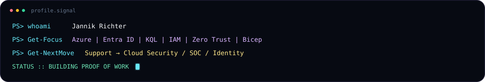
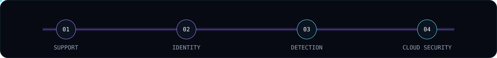

<p align="center">
  
</p>

<p align="center">
  <a href="https://varitqz.github.io/Portfolio-CV/"></a>
  <a href="https://github.com/varitqz/Cloud-Security-Fundamentals-Lab"></a>
  <a href="https://www.linkedin.com/in/jannik-richter-41b629373/"></a>
</p>

<p align="center">
  
</p>

## `// trajectory`

<p align="center">
  
</p>

I use my **IT-support foundation** to build toward **Cloud Security, Security Operations and Identity & Access**. My workflow is deliberately practical: **learn → build → investigate → explain → prove**.

## `// current_signal`

| Signal | Hands-on focus |
| --- | --- |
| `IDENTITY` | Microsoft Entra ID · Azure RBAC · role assignments · Zero Trust |
| `DETECTION` | KQL · SigninLogs · AuditLogs · failed sign-in triage · role-change investigations |
| `CLOUD` | Azure hierarchy · networking fundamentals · Defender for Cloud · Sentinel concepts |
| `AUTOMATION` | Bicep · PowerShell · Git · repeatable lab infrastructure |

## `// featured_builds`

### 🛡️ Cloud Security Fundamentals Lab
Local-first training platform combining **AZ-900 / SC-900 concepts, Identity & Access reviews, Zero Trust investigations, KQL detections and Bicep examples**.

**Proof of work:** original training content · investigation logic · hands-on KQL practice · technical documentation

**[Repository](https://github.com/varitqz/Cloud-Security-Fundamentals-Lab)** · **[Live Lab](https://varitqz.github.io/Cloud-Security-Fundamentals-Lab/)**

### ⚡ Interactive Portfolio / CV
Responsive portfolio with **German/English mode, recruiter view, KQL drawer, terminal interactions and GitHub Pages deployment**.

**[Repository](https://github.com/varitqz/Portfolio-CV)** · **[Live Portfolio](https://varitqz.github.io/Portfolio-CV/)**

## `// toolkit`

`Azure` `Entra ID` `KQL` `IAM` `Zero Trust` `Bicep` `PowerShell` `Git` `VS Code`

## `// learning_now`

```text
[ACTIVE] AZ-900 preparation
[ACTIVE] SC-900 preparation
[ACTIVE] KQL investigations: SigninLogs / AuditLogs
[ACTIVE] Entra ID / IAM role-assignment analysis
[BUILD ] Bicep + Azure lab infrastructure
```

> AZ-900 and SC-900 are currently **in preparation**, not claimed as earned certifications.

---

<p align="center">
  <code>support foundation → cloud skills → security investigations → proof of work</code>
</p>
