<p align="center">
  
</p>

<p align="center">
  
</p>

<p align="center">
  <strong>IT Support Specialist → Cloud Security / SOC / Identity & Access</strong><br/>
  Hamburg · Azure · Entra ID · KQL · IAM · Zero Trust · Bicep
</p>

<p align="center">
  <a href="https://varitqz.github.io/Portfolio-CV/">Portfolio</a> ·
  <a href="https://github.com/varitqz/Cloud-Security-Fundamentals-Lab">Cloud Security Lab</a> ·
  <a href="https://www.linkedin.com/in/jannik-richter-41b629373/">LinkedIn</a>
</p>

```powershell
PS C:\Users\varitqz> whoami
Jannik Richter

PS C:\Users\varitqz> Get-Focus
Azure | Entra ID | KQL | IAM | Zero Trust | Bicep

PS C:\Users\varitqz> Get-NextMove
Support foundation -> Cloud Security / SOC / Identity
```

## `// current_signal`

I currently work in **IT Support** and use that operational foundation to build toward **Cloud Security, Security Operations and Identity & Access**.

My approach is simple: **learn → build → investigate → explain → prove**. I prefer hands-on labs and reproducible investigation workflows over collecting buzzwords.

| Signal | Current work |
| --- | --- |
| `IDENTITY` | Microsoft Entra ID, Azure RBAC, role assignments, authentication vs authorization, Zero Trust |
| `DETECTION` | KQL, SigninLogs, AuditLogs, failed sign-in triage, role-change investigations |
| `CLOUD` | Azure hierarchy, networking fundamentals, Defender for Cloud, Sentinel concepts |
| `AUTOMATION` | Bicep, Git, PowerShell, repeatable lab infrastructure |

## `// featured_builds`

### 🛡️ Cloud Security Fundamentals Lab
Local-first training platform combining **AZ-900 / SC-900 concepts, Identity & Access reviews, Zero Trust investigations, KQL detections and Bicep examples**.

**Proof of work:** original training content, investigation logic, hands-on KQL practice, security scenarios and technical documentation.

**[Repository](https://github.com/varitqz/Cloud-Security-Fundamentals-Lab)** · **[Live Lab](https://varitqz.github.io/Cloud-Security-Fundamentals-Lab/)**

### ⚡ Interactive Portfolio / CV
A responsive, dependency-free portfolio with **German/English mode, recruiter view, KQL drawer, terminal-style interactions and GitHub Pages deployment**.

**[Repository](https://github.com/varitqz/Portfolio-CV)** · **[Live Portfolio](https://varitqz.github.io/Portfolio-CV/)**

## `// toolkit`

`Azure` `Entra ID` `KQL` `IAM` `Zero Trust` `Bicep` `PowerShell` `Git` `VS Code`

## `// learning_now`

```text
[ACTIVE] AZ-900 preparation
[ACTIVE] SC-900 preparation
[ACTIVE] KQL investigations: SigninLogs / AuditLogs
[ACTIVE] Entra ID / IAM role-assignment analysis
[BUILD ] Bicep + Azure lab infrastructure
```

> AZ-900 and SC-900 are currently **in preparation**, not claimed as earned certifications.

---

<p align="center">
  <code>support foundation → cloud skills → security investigations → proof of work</code>
</p>
